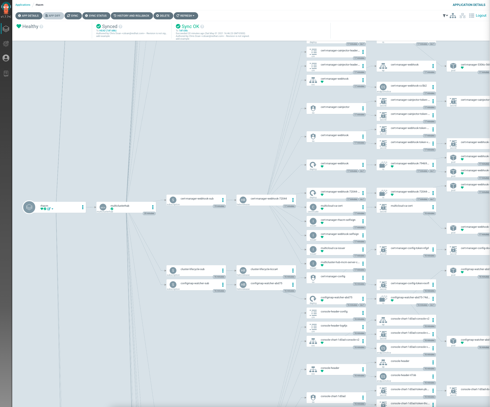

# rhacm-kustomization-app

We can use this repo to deploy RHACM via argo-cd application.
The app consists of both the operator and the instance.

* When combined, install runs very nice. However, when we go to uninstall,
  there are chances that the sub-component helm charts do not get uninstall properly. Most likely this is a timing issue, and the `- uninstall-helm-release` are not enough to block to cleanup of multiclusterhub or the csv.

# Usage

After you connect to an argo-cd context, create an app, via the cli:

```bash
#!/bin/bash

DEST_SERVER=${DEST_SERVER:-https://kubernetes.default.svc}
DEST_NS=${DEST_NS:-default}

argocd app create \
--project default \
--label cluster=sprint \
--label owner=cdoan \
--label release=2.3.0 \
--name rhacm \
--repo https://github.com/cdoan1/rhacm-kustomization-app.git \
--path rhacm-operator-instance/base \
--dest-server ${DEST_SERVER} \
--dest-namespace ${DEST_NS} \
--sync-policy automated
```

# Example


